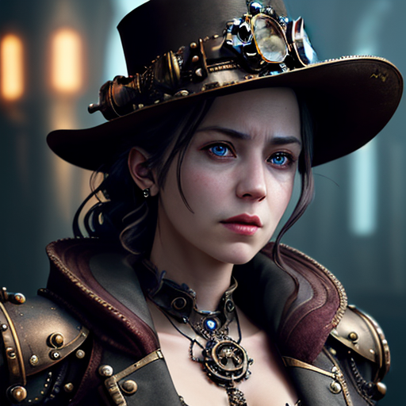
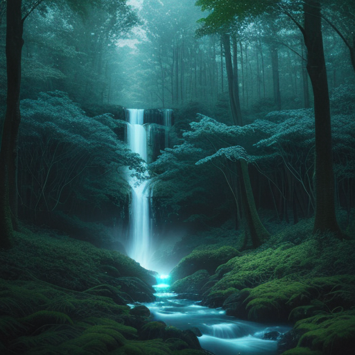
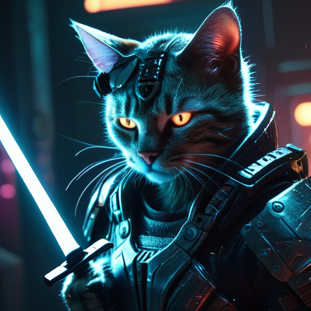

# 🎨 Local AI Image Generator Studio

A high-performance, **100% private**, and entirely local AI image generation suite. Built with a modern **FastAPI** backend and a sleek **React + Tailwind CSS v4** frontend.

---

## 📸 Example Results

Experience the quality of local generation across different styles:

| 🎬 Cinematic | 📸 Product | 🧚 Affiliate |
|:---:|:---:|:---:|
|  |  |  |
|  |  |  |

---

## ✨ Key Features

- **🚀 100% Offline**: No API keys, no subscriptions, no tracking. Your data stays on your disk.
- **🖼️ SDXL & SD 1.5 Support**: Full compatibility with `.safetensors` and `.ckpt` checkpoints.
- **🔄 Image-to-Image (Img2Img)**: Upload a reference image to guide the AI, perfect for product redesigns or style transfer.
- **⚡ Sequential Generation**: Images appear one-by-one as they are generated, providing instant gratification.
- **📦 Persistent History**: Your generation history is saved locally in the browser. Refreshing won't lose your work!
- **🔍 Lightbox Preview**: Full-screen preview for every image with high-res download and prompt copying.
- **💎 Premium UI**: Modern dark-mode interface with glassmorphism and smooth animations.
- **🪄 Magic Enhancer**: Smart prompt engine that cleans input and intelligently truncates to stay within CLIP (77-token) limits.
- **🛠️ Commercial Presets**: Specialized "Product", "Affiliate", and "Poster" styles for marketing needs.

---

## 💻 Technical Specifications

### System Requirements
| Component | Minimum Requirement | Recommended |
|:---|:---|:---|
| **OS** | Windows 10/11, Linux, macOS | Windows 11 / Ubuntu |
| **Python** | 3.10.x | 3.11.x |
| **Node.js** | v18.x (LTS) | v20.x (LTS) |
| **GPU** | NVIDIA (4GB+ VRAM) | NVIDIA RTX (8GB+ VRAM) |
| **RAM** | 16GB | 32GB |

---

## 📂 Project Structure

- 🏗️ `/models`: Place your `.safetensors` or `.ckpt` models here.
- 🎨 `/lora`: Specific LoRA enhancement files.
- 📂 `/outputs`: Where your generated images are automatically saved.

---

## 🛠️ Installation & Setup

### ⚡ Quick Start
1. **Windows**: Double-click `install.bat`.
2. **Mac/Linux**: `chmod +x install.sh && ./install.sh`.

### 📖 Manual Setup
1. **Backend**:
   ```powershell
   cd backend
   python -m venv venv
   .\venv\Scripts\activate
   pip install torch torchvision torchaudio --index-url https://download.pytorch.org/whl/cu121
   pip install -r requirements.txt
   ```
2. **Frontend**:
   ```bash
   cd frontend
   npm install
   ```

---

## ⚙️ Configuration (.env)

Customize your setup by creating `.env` files based on the `.env.example` templates:

### Backend (`backend/.env`)
- `DEVICE`: `cuda` for GPU or `cpu` for standard mode.
- `HOST`/`PORT`: Server network settings.
- `USE_SEQUENTIAL_OFFLOAD`: Set to `1` for aggressive memory saving.

### Frontend (`frontend/.env`)
- `VITE_API_BASE_URL`: Pointer to your backend API.

---

### ⚡ Unified Launch (New!)
You can now start both the backend and frontend with a single command:
1. **Windows**: Double-click `run.bat`.
2. **Mac/Linux**: Run `chmod +x run.sh && ./run.sh`.

### 📖 Manual Execution
If you prefer running them separately:

1. **Start Backend**:
   ```powershell
   # Windows
   .\venv\Scripts\python.exe backend\main.py
   ```
2. **Start Frontend**:
   ```bash
   cd frontend
   npm run dev
   ```

🌐 **Access the Studio:** [http://localhost:5173](http://localhost:5173)

---

---

## 🌐 Public Deployment Guide

Jika Anda ingin mengunggah aplikasi ini ke server publik (bukan hanya lokal), ikuti panduan ini:

### 1. Persyaratan Server (VPS/Cloud)
Karena aplikasi ini berat, Anda membutuhkan server dengan:
- **GPU:** Wajib memiliki NVIDIA GPU (misal: AWS G4dn, Google Cloud A2, atau RunPod).
- **RAM:** Minimal 16GB.
- **Disk:** Minimal 50GB untuk menyimpan model AI.

### 2. Persiapan Backend (Server)
1. Clone repositori ke server Anda.
2. Pastikan port `8000` (atau port pilihan Anda) terbuka di Firewall.
3. Gunakan **Gunicorn** atau **PM2** untuk menjalankan backend agar tetap aktif:
   ```bash
   pip install gunicorn uvloop
   gunicorn -w 1 -k uvicorn.workers.UvicornWorker backend.main:app --bind 0.0.0.0:8000
   ```

### 3. Persiapan Frontend (Build)
Jangan jalankan `npm run dev` di server publik. Gunakan versi produksi:
1. Update `frontend/.env` dengan IP/Domain server Anda:
   ```env
   VITE_API_BASE_URL=http://your-server-ip:8000
   ```
2. Build project:
   ```bash
   cd frontend
   npm run build
   ```
3. Folder `dist` yang dihasilkan bisa di-host menggunakan **Nginx**, **Apache**, atau layanan seperti **Vercel** dan **Netlify**.

### 4. Keamanan
- **CORS:** Di `main.py`, pastikan `allow_origins=["*"]` diganti dengan domain frontend Anda untuk keamanan ekstra.
- **HTTPS:** Gunakan **Cloudflare** atau **Let's Encrypt** untuk enkripsi SSL.

---

## ⚡ Troubleshooting & Performance

- **CUDA Timeout**: If your GPU times out (TDR), reduce **Resolution** or **Steps**.
- **Low VRAM**: Enable `USE_SEQUENTIAL_OFFLOAD=1` in `backend/.env` for slower but more stable generation.
- **Product/Affiliate Use**: Use the "Product" preset for clean studio shots or "Affiliate" for authentic lifestyle aesthetics.

---
*Created with ❤️ for the AI Art community. by Asep Surya Somantri*
